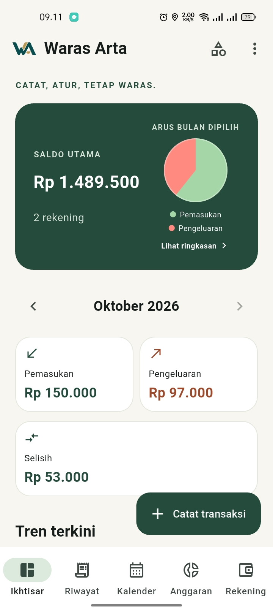
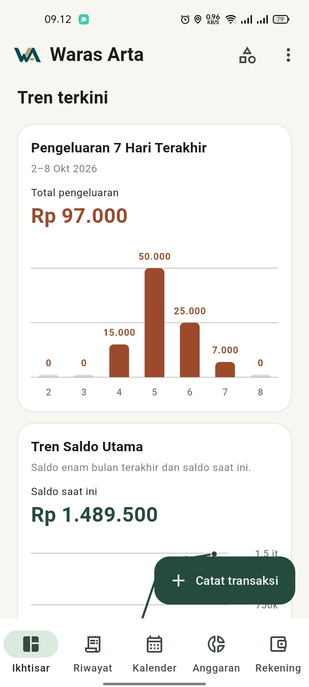
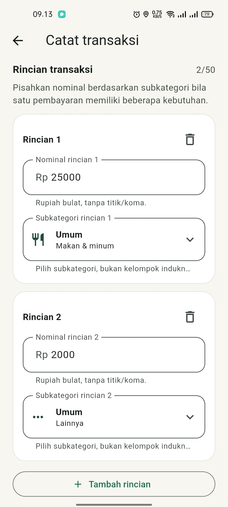
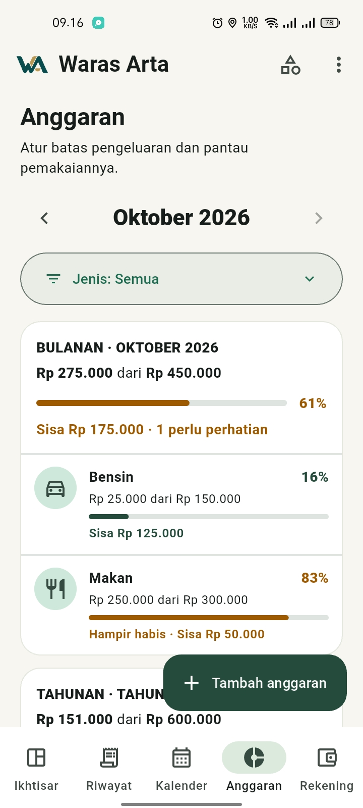
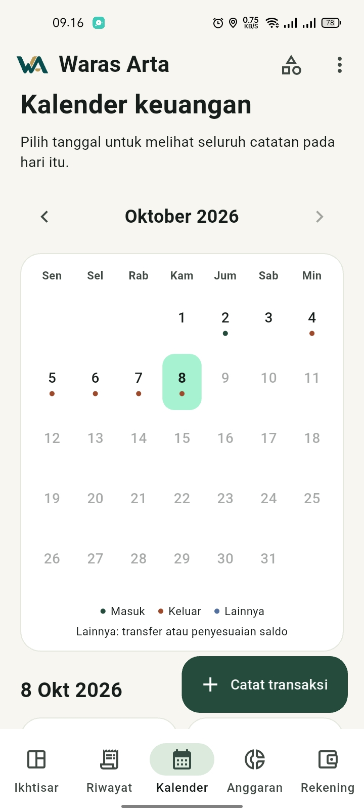
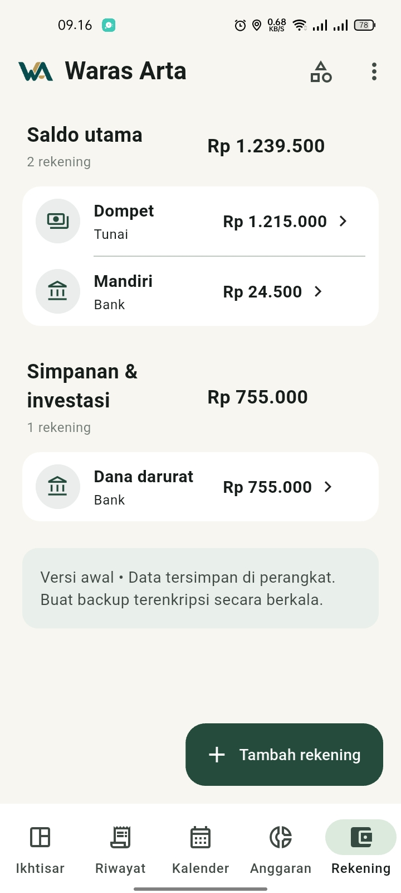

<p align="center">
  
</p>

<p align="center">
  <strong>Catat, atur, tetap waras.</strong>
</p>

<p align="center">
  Aplikasi pencatatan keuangan pribadi local-first untuk Android.<br>
  Berbahasa Indonesia, menggunakan rupiah, dan dapat dipakai tanpa akun maupun koneksi internet untuk fungsi utamanya.
</p>

<p align="center">
  <a href="https://github.com/panjiarif/waras-arta/releases/download/v0.1.0/waras-arta-v0.1.0-android.apk">Unduh APK v0.1.0</a>
  ·
  <a href="https://github.com/panjiarif/waras-arta/releases/tag/v0.1.0">Catatan rilis</a>
  ·
  <a href="https://github.com/panjiarif/waras-arta/issues/new">Laporkan masalah</a>
</p>

## Status proyek

Versi publik terbaru adalah **v0.1.0 — Alpha 1** untuk Android 7.0 atau lebih baru.

> [!WARNING]
> Ini adalah versi alpha untuk pengujian awal. Gunakan data percobaan terlebih dahulu dan jangan menjadikannya satu-satunya tempat menyimpan catatan keuangan penting.

## Tangkapan layar

Seluruh nama rekening dan nominal pada tangkapan layar merupakan data contoh.

<table>
  <tr>
    <td align="center"><strong>Ikhtisar</strong></td>
    <td align="center"><strong>Tren terkini</strong></td>
    <td align="center"><strong>Transaksi dengan rincian</strong></td>
  </tr>
  <tr>
    <td></td>
    <td></td>
    <td></td>
  </tr>
  <tr>
    <td align="center"><strong>Anggaran</strong></td>
    <td align="center"><strong>Kalender</strong></td>
    <td align="center"><strong>Rekening</strong></td>
  </tr>
  <tr>
    <td></td>
    <td></td>
    <td></td>
  </tr>
</table>

## Unduh dan instal

- [Unduh langsung APK Android v0.1.0](https://github.com/panjiarif/waras-arta/releases/download/v0.1.0/waras-arta-v0.1.0-android.apk)
- [Buka halaman rilis v0.1.0](https://github.com/panjiarif/waras-arta/releases/tag/v0.1.0)

Setelah APK selesai diunduh:

1. Buka file `waras-arta-v0.1.0-android.apk`.
2. Jika diminta, izinkan pemasangan aplikasi dari sumber tersebut.
3. Ikuti konfirmasi instalasi Android.
4. Untuk pembaruan berikutnya, pasang APK baru di atas versi lama tanpa menghapus aplikasi terlebih dahulu.

Jika perangkat sebelumnya memakai build debug atau APK dengan signature berbeda, Android mungkin meminta versi lama dihapus. Buat backup lebih dahulu karena menghapus aplikasi juga menghapus database lokalnya.

## Fitur utama

- Mencatat pemasukan, pengeluaran, dan transfer antar-rekening.
- Membagi satu transaksi ke beberapa nominal dan subkategori.
- Mengelola rekening dalam kelompok **Saldo utama** serta **Simpanan & investasi**.
- Mengoreksi saldo melalui entri penyesuaian yang tetap dapat ditelusuri.
- Mengarsipkan dan memulihkan rekening tanpa memutus riwayat transaksi.
- Mengelola kategori dan subkategori pemasukan maupun pengeluaran.
- Menelusuri aktivitas melalui kalender, riwayat bulanan, dan detail transaksi.
- Membuat anggaran bulanan, tahunan, atau periode kustom.
- Menyalin anggaran bulanan sebelumnya secara manual.
- Melihat ikhtisar saldo, arus kas, ringkasan bulanan, dan grafik ringan.
- Membuat serta memulihkan backup terenkripsi berformat `.warasarta`.

## Tentang data dan backup

Data aktif disimpan secara lokal pada penyimpanan privat aplikasi. Waras Arta tidak meminta akun, tidak memiliki server aplikasi, tidak meminta izin Internet pada APK release, dan tidak menyinkronkan data ke cloud secara otomatis.

Hal yang perlu diperhatikan:

- Uninstall, hapus data aplikasi, kerusakan, atau kehilangan perangkat dapat menghapus data yang belum dicadangkan.
- Backup hanya dibuat secara manual saat pengguna menekan tombol **Buat backup**.
- Simpan beberapa salinan backup di lokasi berbeda.
- Kata sandi backup tidak disimpan dan tidak dapat dipulihkan jika terlupa.
- File `.warasarta` dienkripsi, tetapi database SQLite aktif belum dienkripsi secara khusus oleh Waras Arta.
- Uji proses backup dan restore menggunakan data percobaan sebelum mengandalkannya.

Rincian teknis tersedia di [dokumentasi backup dan restore](docs/backup-restore.md).

## Panduan untuk tester

Mulailah dengan data percobaan, lalu coba alur berikut:

1. Buat beberapa rekening.
2. Catat pemasukan, pengeluaran dengan rincian, dan transfer.
3. Edit serta hapus transaksi percobaan.
4. Buat anggaran dan periksa progresnya.
5. Tutup lalu buka kembali aplikasi untuk memastikan data tetap ada.
6. Buat backup terenkripsi dan uji restore.
7. Laporkan perilaku yang tidak sesuai melalui [GitHub Issues](https://github.com/panjiarif/waras-arta/issues/new).

Sertakan versi aplikasi, tipe HP, versi Android, langkah untuk mengulangi masalah, hasil yang diharapkan, dan hasil yang terjadi. Jangan unggah file backup, database, kata sandi, atau screenshot yang memuat data keuangan pribadi ke issue publik.

## Batasan Alpha 1

Belum tersedia:

- Tujuan Keuangan.
- Utang dan piutang.
- Backup otomatis.
- Sinkronisasi cloud.
- Gambar kategori dari unggahan pengguna.
- Analitik kategori, anggaran, dan tujuan yang lebih lengkap.

## Verifikasi rilis

Rilis `v0.1.0` menggunakan:

| Item | Nilai |
| --- | --- |
| Versi aplikasi | `0.1.0` |
| Build number | `1` |
| Application ID | `io.github.panjiarif.waras_arta` |
| Minimum Android | API 24 / Android 7.0 |
| Schema database | v6 |
| Payload backup | v4 |
| Analisis statis | Tidak ditemukan masalah |
| Pengujian otomatis | 316 tes berhasil |

SHA-256 APK:

```text
E40592F42CF721943FE2EBADA6C685AF45F148D689E3E8A37892BC60B53506C5
```

SHA-256 sertifikat signing:

```text
877B638DCA2ACBE157669BD162BF7062FDC16E1A28AC4EF481A7C689C566B77E
```

Di Windows, checksum APK dapat diperiksa dengan:

```powershell
Get-FileHash .\waras-arta-v0.1.0-android.apk -Algorithm SHA256
```

## Pengembangan

Waras Arta dibangun menggunakan Flutter/Dart, Material 3, Riverpod, `go_router`, dan Drift/SQLite. Arsitektur aplikasi memakai MVVM, repository, serta aliran data satu arah. Saldo berasal dari ledger dan nominal disimpan sebagai bilangan bulat rupiah.

Siapkan Flutter, JDK 17, Android SDK, dan perangkat Android dengan USB debugging. Dari root repository:

```bash
flutter pub get
dart run build_runner build
flutter analyze
flutter test
flutter devices
flutter run -d DEVICE_ID
```

Ganti `DEVICE_ID` dengan ID perangkat yang ditampilkan oleh `flutter devices`. Proyek ini saat ini hanya menargetkan Android.

## Dokumentasi

- [Product brief dan ruang lingkup versi](docs/product-brief.md)
- [Arsitektur dan aturan data](docs/architecture.md)
- [Backup, keamanan, dan pemulihan](docs/backup-restore.md)
- [Alokasi kategori transaksi](docs/transaction-allocations.md)
- [Anggaran v1](docs/budgets.md)
- [Rancangan Tujuan Keuangan v1](docs/financial-goals.md)
- [Panduan pengembangan dan verifikasi](docs/development.md)

## Lisensi

Lisensi kode sumber belum ditetapkan. Repositori publik tidak otomatis berarti proyek open-source. Sampai file `LICENSE` ditambahkan, tidak ada izin umum untuk menggunakan, mengubah, atau mendistribusikan ulang kode sumber ini.
